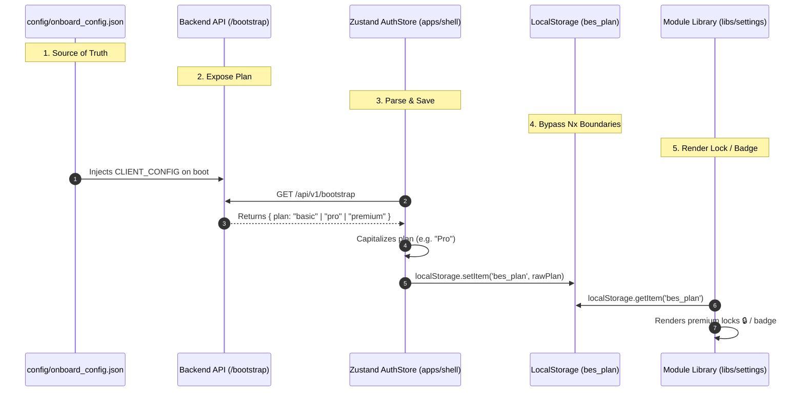

# 6. Licensing & Subscription Tier Flow — BES

This document maps out the end-to-end tracing and orchestration of subscription tiers and licensing gates between the backend and the frontend Nx monorepo.

---

## Architecture Flow Overview



---

## 1. Source of Truth (Backend Onboard Config)
Each client instance has its subscription plan defined on provisioning:
- **Path**: `instances/<client_id>/config/onboard_config.json`
- **Schema**:
  ```json
  {
    "client_id": "msme",
    "client_name": "MSME Operations",
    "plan": "premium",
    "licensed_modules": ["settings", "sales", "inventory"]
  }
  ```

---

## 2. Backend Bootstrap Endpoint Exposing
During application setup, the `CLIENT_CONFIG` is booted. The `/bootstrap` route reads and returns the active plan:
- **Path**: `instances/<client_id>/<client_id>/api/endpoints.py`
- **Payload**:
  ```python
  @router.get("/api/v1/bootstrap")
  async def bootstrap(user: User = Depends(get_current_user)):
      return {
          "status": "success",
          "data": {
              "client_name": CLIENT_CONFIG.get("client_name"),
              "active_modules": LICENSED_MODULES,
              "plan": CLIENT_CONFIG.get("plan", "premium"),  # <-- Added Plan Tier
              "user_id": str(user.id),
              "username": user.username,
              "permissions": user_perms["permissions"],
          }
      }
  ```

---

## 3. Frontend Zustand Storage & Caching
Upon operator authentication or application refresh, the shell's global store fetches the bootstrap metadata:
- **Path**: `apps/shell/src/store/auth-store.ts`
- **Actions (`login` / `initialize`)**:
  ```typescript
  const bootPlanRaw = boot.plan || 'premium'; // basic | pro | premium
  const clientPlan = (bootPlanRaw.charAt(0).toUpperCase() + bootPlanRaw.slice(1)) as 'Basic' | 'Pro' | 'Premium';

  localStorage.setItem('bes_plan', bootPlanRaw); // Cache plan raw
  set({
    currentUser: mappedUser,
    clientName: boot.client_name,
    clientPlan, // Store reactively in Zustand
    isAuthenticated: true
  });
  ```
- **Action (`logout`)**:
  ```typescript
  localStorage.removeItem('bes_plan');
  set({ clientPlan: 'Premium', currentUser: null });
  ```

---

## 4. Nx Module Boundary Bypass
Because Nx monorepo rules restrict sub-libraries (`libs/*`) from relatives-importing from shell applications (`apps/shell/*`), the module libraries retrieve the plan tier directly from `localStorage` rather than importing from the Zustand hook, avoiding module boundary errors (`@nx/enforce-module-boundaries`):
- **Path**: `libs/<module>/src/lib/<component>`
- **Retrieval hook**:
  ```typescript
  const rawPlan = localStorage.getItem('bes_plan') || 'premium';
  const activeTier = (rawPlan.charAt(0).toUpperCase() + rawPlan.slice(1)) as 'Basic' | 'Pro' | 'Premium';
  ```

---

## 5. UI Rendering & Gating
Once the `activeTier` is parsed, components dynamically adjust their layout states according to licensing limits by injecting lock symbols and upgrade triggers dynamically:
```tsx
// Gating pro/premium feature tabs
<Tab>
  <div style={{ display: 'flex', alignItems: 'center', gap: 6 }}>
    <Shield size={16} /> Roles & Permissions
    {activeTier === 'Basic' && <PremiumLockIndicator size={12} />}
  </div>
</Tab>

// Gating actions / limit checks
const handleAddSubsidiary = () => {
  if (activeTier === 'Basic' && subsidiaries.length >= 1) {
    setShowUpgradeGate('Multi-Subsidiary Hierarchies');
  } else {
    // proceed
  }
};
```
