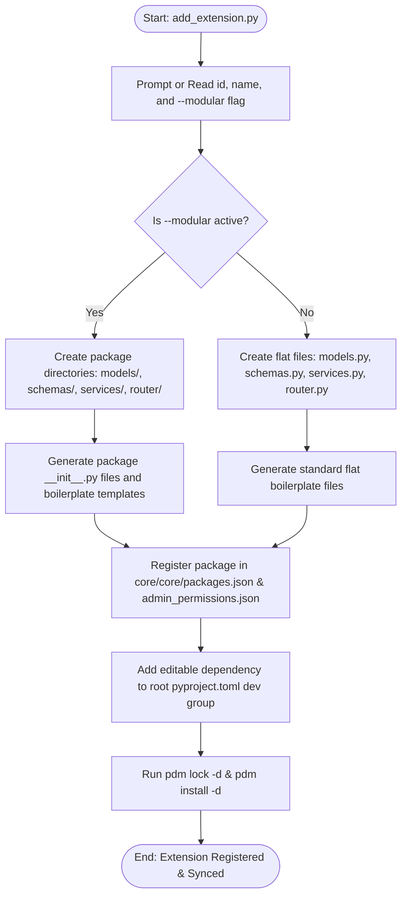
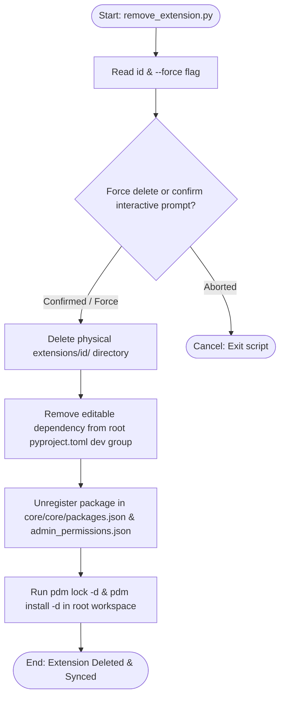
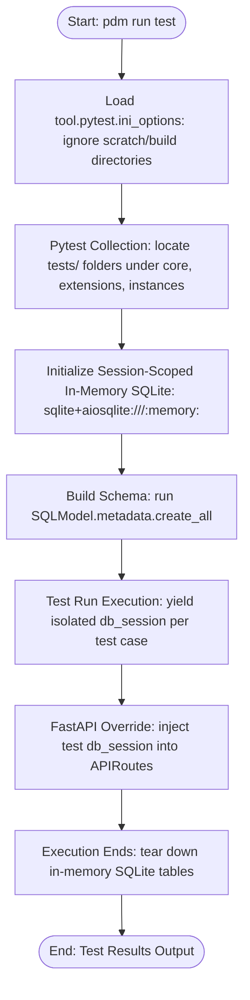
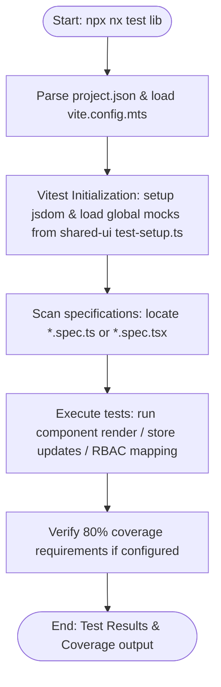
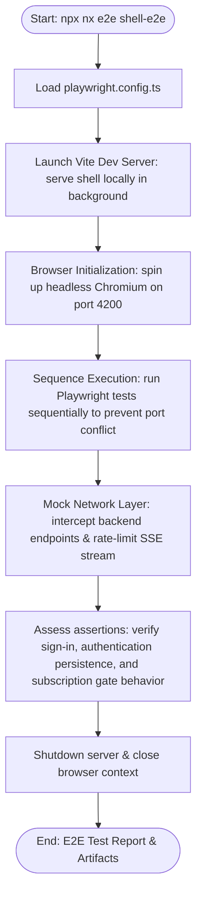

# Backend Architecture Process Flows

This document contains Mermaid diagrams illustrating the workflows parallel to the commands in [run.md](file:///Users/bvk/BVK_Workspace/BES/bvk-items/commands/backend/run.md).

---

## 1. Extension Creation Workflow (`add_extension.py`)

---

## 2. Extension Deletion Workflow (`remove_extension.py`)

---

## 3. Client Onboarding Workflow (`onboard_client.py`)

---

## 4. License Upgrade/Degrade Workflow (`change_license.py`)

---

## 5. Client Server Lifespan & Boot Workflow (`uvicorn`)

---

## 6. Testing Pipeline Workflow (`pdm run test`)

---

## 7. Frontend Unit & Component Testing Pipeline (`npx nx test [lib]`)

---

## 8. Frontend E2E Testing Pipeline (`npx nx e2e shell-e2e`)

