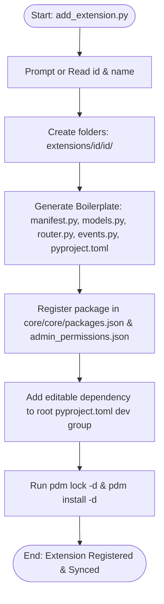
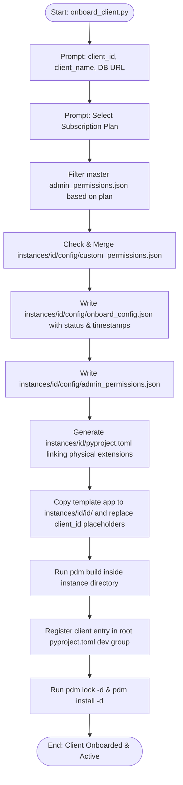
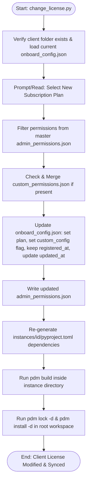
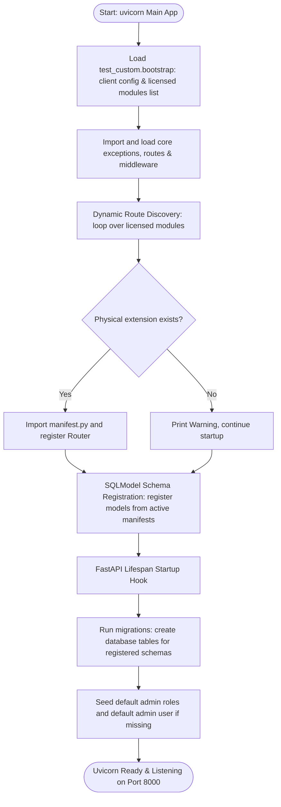

# Backend Architecture Process Flows

This document contains Mermaid diagrams illustrating the workflows parallel to the commands in [run.txt](file:///Users/bvk/BVK_Workspace/BES/bvk-items/commands/backend/run.txt).

---

## 1. Extension Creation Workflow (`add_extension.py`)

---

## 2. Client Onboarding Workflow (`onboard_client.py`)

---

## 3. License Upgrade/Degrade Workflow (`change_license.py`)

---

## 4. Client Server Lifespan & Boot Workflow (`uvicorn`)

