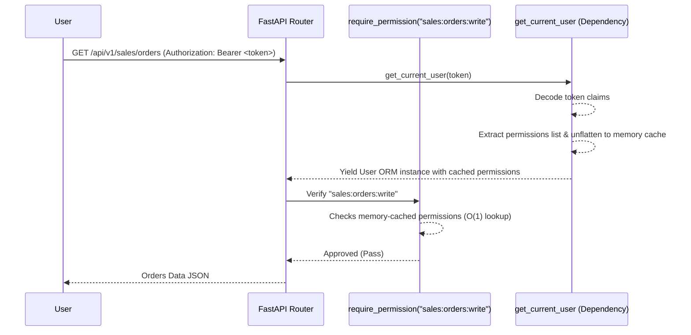

# Identity & Access Control (RBAC & JWT Permissions)

Bes uses a **context-aware, stateless, hybrid-hierarchical Role-Based Access Control (RBAC)** architecture. This document outlines the operational mechanisms, cryptographic optimization strategy, and structural layout of the security layer.

---

## 1. Core Architectural Pillars

### A. Stateless Authorization via JWT-Encoded Claims
Traditional systems query the database multiple times on every HTTP request to resolve roles, active permissions, and user profiles. To optimize performance, Bes encodes resolved permissions directly inside the signed JWT access token.
* **The Performance Win**: Database queries for roles, merges, and permissions are **completely eliminated** during request-scoped validation, dropping permissions checks to in-memory, local operations.
* **Compact String Arrays**: Permissions are flattened from nested database JSON models into a compact array of colon-separated strings: `["finance:coa:read", "sales:orders:write"]`.
* **Superuser Payload Compression**: For superusers, the permissions array is omitted entirely, and a single `"superuser": true` flag is packed instead to minimize token size.

### B. Request-Scoped Context Awareness
We utilize thread-safe `ContextVar` instances to maintain request execution states globally:
* **`subsidiary_id_context`**: Request-wide multi-tenant identifier derived from incoming API headers, triggering automatic row-level filters in database queries.
* **`correlation_id_context`**: Request latency and lifecycle trace token propagated down to events, background logs, and change records.
* **`execution_context` (`USER` vs `SYSTEM`)**:
  * `USER` context enforces JWT verification, permission constraints, and licensing limits.
  * `SYSTEM` context (activated via `with elevate_context():`) allows automated workers and asynchronous event bus listeners to execute internal jobs bypass-privileged.

### C. Enhanced Session Metadata Pinning
Each issued token contains structural environment metadata to increase security and log auditability:
* **`sid` (Session ID)**: A unique UUID representing this specific login session, allowing individual session revocation (e.g. logging out a laptop while leaving a mobile device active).
* **`sub_id`**: Active subsidiary scope.
* **`ip` / `ua`**: Client IP address and device User-Agent pinned at issuance time to enable audit logging and session environments verification.

---

## 2. Directory Layout & Modular Structure

The security layer is decoupled across specialized, clean modules inside the core backend:

```
Bes/backend/core/core/
├── context.py               # Lightweight thread-safe ContextVars
├── auth.py                  # Password cryptography & JWT lifecycle (verify/issue)
├── admin_permissions.json   # Seed permissions configuration
├── models/
│   ├── base.py              # BESBase model with UUID keys & audit columns
│   └── auth.py              # User, Role, and RefreshToken SQLModels
├── rbac/
│   ├── __init__.py          # Barrel re-export file
│   ├── context.py           # execution_context & elevate_context context manager
│   ├── schema.py            # Role loading & recursive overrides merging
│   ├── claims.py            # Permissions flattening & JWT metadata packing
│   └── guards.py            # Reusable FastAPI require_permission Depends guards
└── middleware/
    ├── __init__.py          # Barrel re-export file
    ├── logging.py           # Latency logs & correlation header trace middleware
    └── security.py          # Tenant resolution and subsidiary_id_context injection
```

---

## 3. Operations Flow


